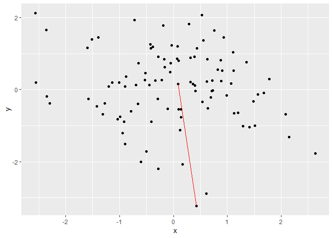

ggplot2 Extention for Fun
================
Yawei Ge, Zhenzhen Chen, Weiquan Luo
3/22/2019

Functions
=========

### `stat_star`

Connect the central point to the farthest point

``` r
madedata <- data.frame(x = rnorm(100, mean = 0, sd = 1),
y = rnorm(100, mean = 0, sd = 1))

library(ggplot2)
library(ggfun)

ggplot(madedata, aes(x = x, y = y)) +
geom_point() +
stat_star(color = "red")
```


