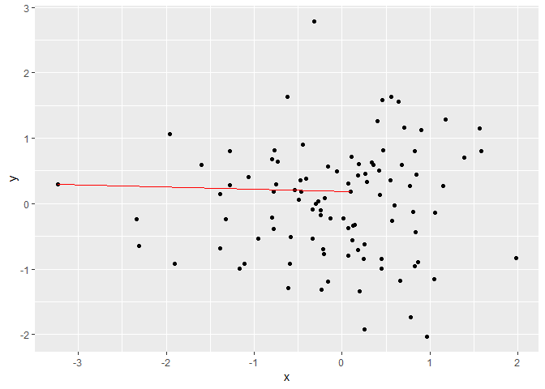

ggplot2 Extension for Fun
================
Yawei Ge, Zhenzhen Chen, Weiquan Luo
3/22/2019

Functions
=========

### `geom_image`

Elephant and donkey

``` r
library(ggplot2)
library(ggfun)
library(dplyr)

ggplot(mtcars, aes(wt, mpg)) + geom_image()
```


### `stat_star`

Connect the central point to the farthest point

``` r
madedata <- data.frame(x = rnorm(100, mean = 0, sd = 1),
                       y = rnorm(100, mean = 0, sd = 1))


ggplot(madedata, aes(x = x, y = y)) +
  geom_point() +
  stat_star(color = "red")
```


### `stat_arrowmap`

Forgive me for this

``` r
madedata_standard %>%
  ggplot() +
  geom_path(aes(x = long, y = lat, group = group)) +
  stat_arrowmap(aes(x = long, y = lat, change = change, group = region))
```



### `layer_PersHomo`

Persistant Homoly of earthquark around pacific plate

``` r
library(magrittr) 
worldmap <- map_data("world2")
p <- ggplot() +
  geom_polygon(data=worldmap, aes(x=long, y=lat, group = group),fill="white", colour="#7f7f7f", size=0.5) +
  theme(axis.line=element_blank(),
        axis.text.x=element_blank(),
        axis.text.y=element_blank(),
        axis.ticks=element_blank(),
        axis.title.x=element_blank(),
        axis.title.y=element_blank(),
        legend.position="none",
        panel.background=element_blank(),
        panel.border=element_blank(),
        panel.grid.major=element_blank(),
        panel.grid.minor=element_blank(),
        plot.background=element_blank())
f <- system.file("extdata", "eqData.txt", package = "ggfun")
eq <- read.delim(f, as.is=T) %>%
  filter(!is.na(LONGITUDE) & !is.na(LATITUDE)) %>%
  filter(LONGITUDE > 110 | LONGITUDE < -45) %>%  mutate(LONGITUDE = ifelse(LONGITUDE < 0, LONGITUDE + 360, LONGITUDE)) %>%
  select(YEAR, MONTH,DAY, EQ_MAG_MS, COUNTRY, LOCATION_NAME, LATITUDE, LONGITUDE)
## add layer_PersHomo
fp <- p + layer_PersHomo(data= eq, mapping = aes(x=LONGITUDE, y=LATITUDE), d=450000, colour = "blue") +
   geom_point(); fp
```


